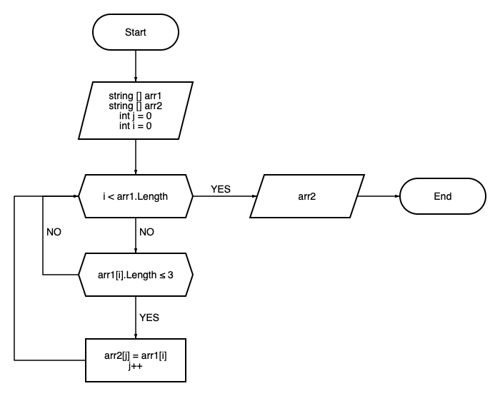

# **Итоговая проверочная работа**
## **Задача:**

Написать программу, которая из имеющегося массива строк формирует массив из строк, длина которых меньше либо равна 3 символа. Первоначальный массив можно ввести с клавиатуры, либо задать на старте выполнения алгоритма. При решении не рекомендуется пользоваться коллекциями, лучше обойтись исключительно массивами.

## **Алгоритм решения:**

1. Создаем и инициализируем два массива: `arr1` и `arr2`.

2. Инициализируем переменную `j` значением 0.

3. Запускаем цикл `for`, который перебирает элементы массива `arr1` по индексам от 0 до `arr1.Length - 1`.

4. Внутри цикла проверяем условие: если длина строки `arr1[i]` меньше или равна 3, выполняем следующие действия:

   - Присваиваем элемент `arr1[i]` элементу массива `arr2` с индексом `j`.
   - Увеличиваем значение `j` на 1.

5. После завершения цикла имеем в массиве `arr2` отфильтрованные элементы из `arr1`.

6. Создаем функцию `PrintArray`, которая принимает массив строк в качестве параметра.

7. В функции `PrintArray` запускаем цикл `for`, который выводит элементы массива на консоль.

8. Вызываем функцию `PrintArray` с аргументом `arr2` для вывода отфильтрованных элементов на консоль.

9. Завершаем выполнение программы.

* ## **Блок-схема:**
